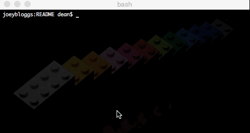

#LARS HTTP Router


lars (Library Access/Retrieval System), is a fast radix-tree based, zero allocation, HTTP router for Go.





Why Another HTTP Router?
------------------------
I have noticed that most routers out there, IMHO, are adding too much functionality that doesn't belong in an HTTP router, and they are turning into web frameworks, with all the bloat that entails. LARS aims to remain a simple yet powerful HTTP router that can be plugged into any existing framework; furthermore LARS allowing the passing of global + application variables that comply with it's IGlobals interface (right on the Context object) makes frameworks redundant as **LARS wraps the framework instead of the framework wrapping LARS**.<add link to an example here>

Unique Features 
--------------
* Context allows the passing of framework/globals/application specific variables via it's Globals field.
  * The Globals object is essentially all of the application specific variables and libraries needed by your handlers and functions, keeping a clear separation between your http and application contexts.
* Handles mutiple url patterns not supported by many other routers.
* Contains helpful logic to help prevent adding bad routes, keeping your url's consistent.
  * i.e. /user/:id and /user/:user_id - the second one will fail to add letting you know that :user_id should be :id
* Has an uber simple middleware + handler definitions!!! middleware and handlers actually have the exact same definition!


Installation
-----------

Use go get 

```go
go get github.com/go-playground/lars
``` 

or to update

```go
go get -u github.com/go-playground/lars
``` 

Then import lars package into your code.

```go
import "github.com/go-playground/lars"
``` 

Getting Started
----------------

Usage
------

Benchmarks
-----------
Run on MacBook Pro (Retina, 15-inch, Late 2013) 2.6 GHz Intel Core i7 16 GB 1600 MHz DDR3 using Go version go1.5.3 darwin/amd64


```go
go test -bench=. -benchmem=true
#GithubAPI Routes: 203
   LARS: 81016 Bytes

#GPlusAPI Routes: 13
   LARS: 6904 Bytes

#ParseAPI Routes: 26
   LARS: 7808 Bytes

#Static Routes: 157
   LARS: 78824 Bytes

PASS
BenchmarkLARS_Param       	20000000	        84.6 ns/op	       0 B/op	       0 allocs/op
BenchmarkLARS_Param5      	10000000	       137 ns/op	       0 B/op	       0 allocs/op
BenchmarkLARS_Param20     	 5000000	       379 ns/op	       0 B/op	       0 allocs/op
BenchmarkLARS_ParamWrite  	10000000	       155 ns/op	       0 B/op	       0 allocs/op
BenchmarkLARS_GithubStatic	20000000	       103 ns/op	       0 B/op	       0 allocs/op
BenchmarkLARS_GithubParam 	10000000	       152 ns/op	       0 B/op	       0 allocs/op
BenchmarkLARS_GithubAll   	   50000	     37226 ns/op	       0 B/op	       0 allocs/op
BenchmarkLARS_GPlusStatic 	20000000	        69.5 ns/op	       0 B/op	       0 allocs/op
BenchmarkLARS_GPlusParam  	20000000	        97.1 ns/op	       0 B/op	       0 allocs/op
BenchmarkLARS_GPlus2Params	10000000	       135 ns/op	       0 B/op	       0 allocs/op
BenchmarkLARS_GPlusAll    	 1000000	      1798 ns/op	       0 B/op	       0 allocs/op
BenchmarkLARS_ParseStatic 	20000000	        89.3 ns/op	       0 B/op	       0 allocs/op
BenchmarkLARS_ParseParam  	20000000	       107 ns/op	       0 B/op	       0 allocs/op
BenchmarkLARS_Parse2Params	10000000	       127 ns/op	       0 B/op	       0 allocs/op
BenchmarkLARS_ParseAll    	  500000	      3735 ns/op	       0 B/op	       0 allocs/op
BenchmarkLARS_StaticAll   	  100000	     23534 ns/op	       0 B/op	       0 allocs/op

```

This package is inspired by the following 
- [httptreemux](https://github.com/dimfeld/httptreemux)
- [httprouter](https://github.com/julienschmidt/httprouter)
- [echo](https://github.com/labstack/echo)

License 
--------
This project is licensed unter MIT, for more information look into the LICENSE file.
Copyright (c) 2016 Go Playground


